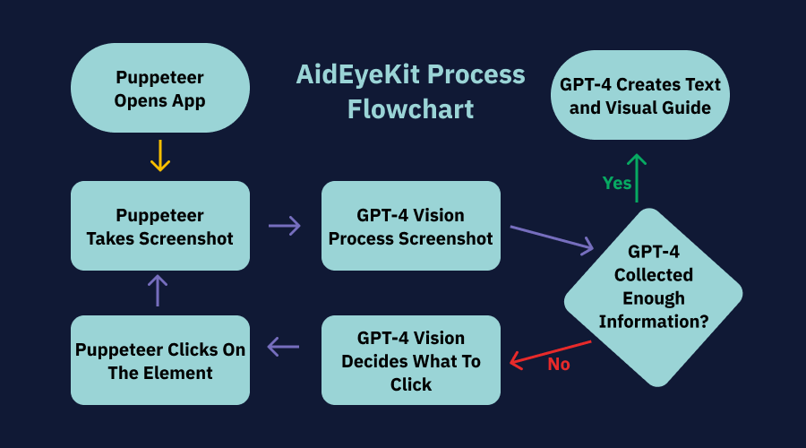

<p align="center">A toolkit that enables app makers to create visual guides within apps.</p>

## Demo

For a more detailed demo with voiceover, click [here](https://youtu.be/gc_1hvezhbc).

https://github.com/DoughnutsNCookies/AidEyeKit-SDK/assets/53002130/7d92543b-ac7d-4558-95c0-b441da5d4812

## How it works

AidEyeKit is a toolkit that consists of an SDK and a backend server. The SDK is used to call APIs easily to the backend server. The backend server is used to process images and generate descriptions for the visual guides.

This project uses Puppeteer and OpenAI's GPT-4 Vision together. Puppeteer first opens the app and takes a screenshot. The screenshot is then sent to OpenAI's GPT-4 Vision to decide which elements it should click to achieve the goal. After the click, another screenshot is taken which repeats the process until the AI reaches the desired goal of the visual guide.



## Building the SDK

To build the SDK, navigate to the `sdk` folder and run the following command:

```sh
bun run build
```

## Testing the SDK Locally

You would need to link the SDK to your local npm registry. To do this, navigate to your test project and run the following command:

```sh
npm link /path/to/this/sdk
```

## Running the Backend Server

This server uses OpenAI's GPT-4 Vision API, so you will need to get an API key from OpenAI.

### Setting up the server

Navigate to the `server` folder and set up your `.env` file in the `server` folder. You can use the `.env.example` file as a template.

Paste your OpenAI API key in the `.env` file like this:

```
OPENAI_API_KEY=your_api_key
```

### Running the server

Before running the backend server, install the dependencies by running the following command:

```sh
npm install
```

To run the server in development mode, run the following command:

```sh
npm run start:dev
```

To run the server in production mode, first build the server by running the following command:

```sh
npm run build
```

Then, run the server by running the following command:

```sh
bun run start
```

## Social Medias

- Website: [aideyekit.com](https://aideyekit.com)
- Twitter: [twitter.com/AidEyeKit](https://twitter.com/AidEyeKit)
- Facebook: [facebook.com/AidEyeKit](https://www.facebook.com/AidEyeKit)
- LinkedIn: [linkedin.com/company/aideyekit](https://www.linkedin.com/company/aideyekit)

## Authors

[@DoughnutsNCookies](https://www.github.com/DoughnutsNCookies)
[@nuyiep](https://www.github.com/nuyiep)
